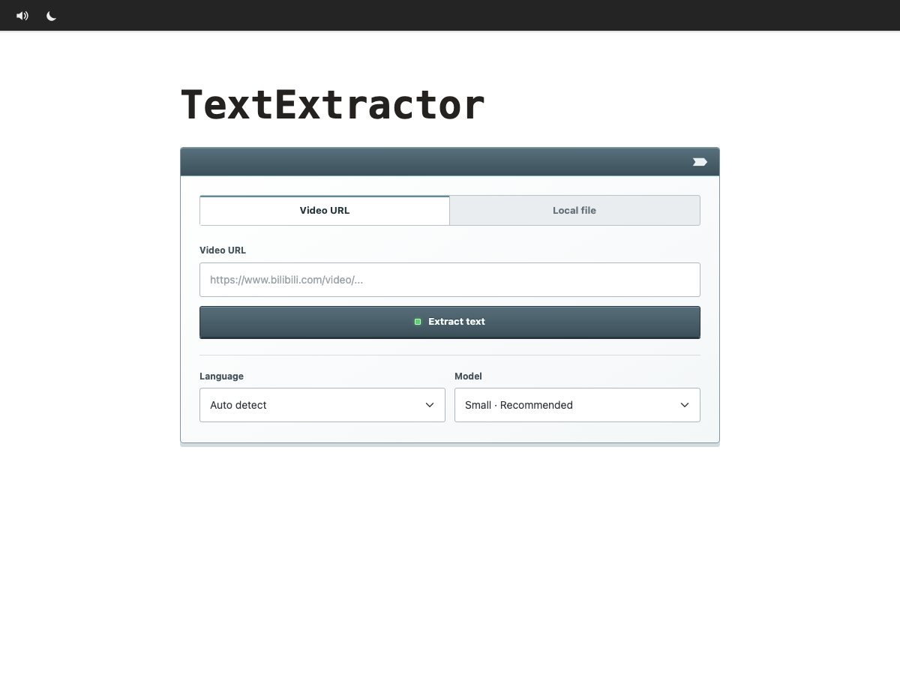
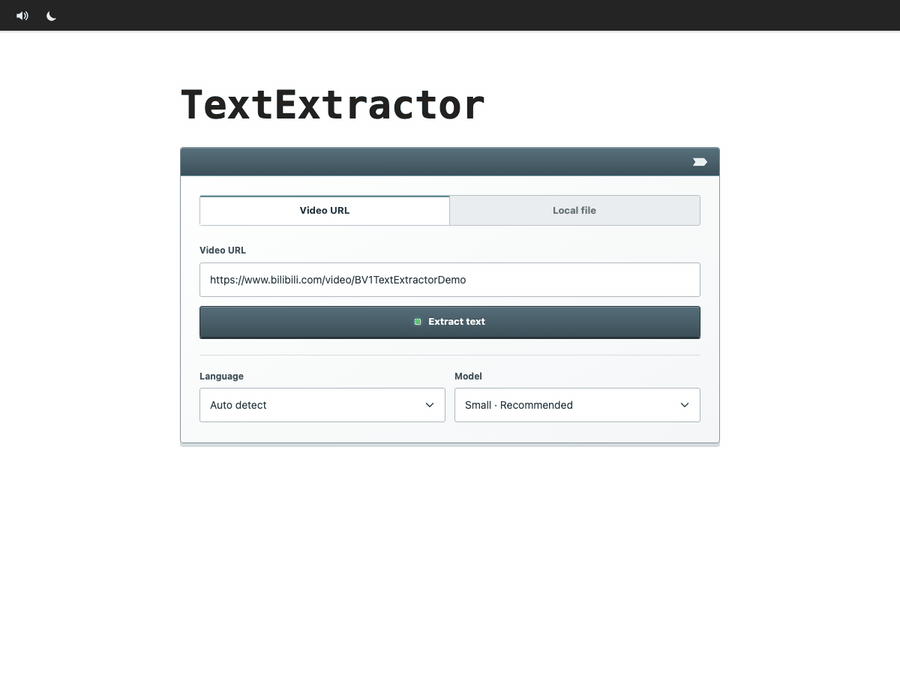

# TextExtractor

TextExtractor turns audio-only Bilibili listening resources into readable transcripts for more effective English practice.

It runs locally on Apple silicon using MLX Whisper and exports plain text, timestamped text, SRT, VTT, and JSON.



## Install

TextExtractor officially supports Apple silicon Macs running macOS 14 Sonoma or newer. MLX Whisper requires Apple silicon, native ARM Python, and macOS 14+.

```bash
brew install troyyitongzhou/tap/textextractor
textextractor
```

Homebrew installs the required Python runtime, FFmpeg, and pinned Python dependencies.

The command starts a local server and opens the browser UI at [http://127.0.0.1:8765](http://127.0.0.1:8765). Use `textextractor --port 8899` to choose another port, or `textextractor --no-browser` to start without opening a browser.

The selected Whisper model is downloaded on first use, so that first transcription needs an internet connection and takes longer to start. The `small` model is the recommended default, especially on an 8 GB M1 Mac.

## Demo



The demo uses synthetic transcript text and shows the basic workflow: enter a video URL, start extraction, follow the current stage, review the transcript, and download the preferred output format.

## Source Checkout Requirements

- An Apple silicon Mac
- Conda (Anaconda or Miniconda)
- Homebrew FFmpeg

Install FFmpeg if needed:

```bash
brew install ffmpeg
```

## Source Checkout

```bash
./start.command
```

Then open [http://127.0.0.1:8765](http://127.0.0.1:8765).

The source launcher creates a local Python 3.12 Conda environment and installs the required packages. It keeps generated transcripts under `data/jobs/`, which is excluded from Git.

Paste a public Bilibili URL or choose a local media file, select the language and model, then click **Extract text**. When processing completes, copy the transcript or download it as TXT, timestamped TXT, SRT, VTT, or JSON.

## Models

- `small`: recommended balance of speed and accuracy
- `medium`: higher accuracy with greater memory use
- `large-v3`: highest accuracy and slowest processing

Selecting English explicitly is usually more stable for English listening material than automatic language detection.

## Bilibili

TextExtractor uses `yt-dlp` with browser impersonation enabled only for Bilibili URLs. Public videos can usually be processed without cookies. Login-protected, paid, DRM-protected, or CAPTCHA-gated media is not bypassed.

## Privacy

- The web server listens only on `127.0.0.1`.
- Transcription runs locally on the Apple GPU.
- Downloaded or uploaded media is deleted after processing.
- Homebrew installs keep generated transcripts under `~/Library/Application Support/TextExtractor/jobs/`.
- Source checkouts keep generated transcripts under `data/jobs/`; that directory is excluded from Git.

## Uninstall

```bash
brew uninstall textextractor
```

Uninstalling the formula does not remove your transcripts. Delete `~/Library/Application Support/TextExtractor/` separately if you no longer need them.

## Test

```bash
.conda/bin/python -m unittest discover -s tests -v
```
